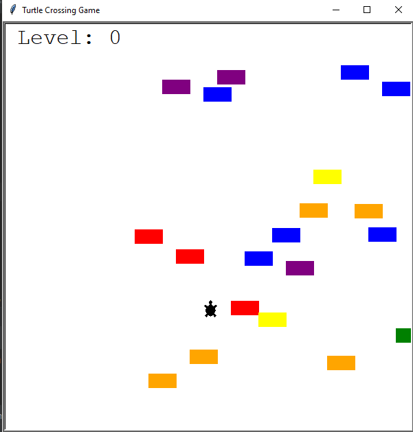
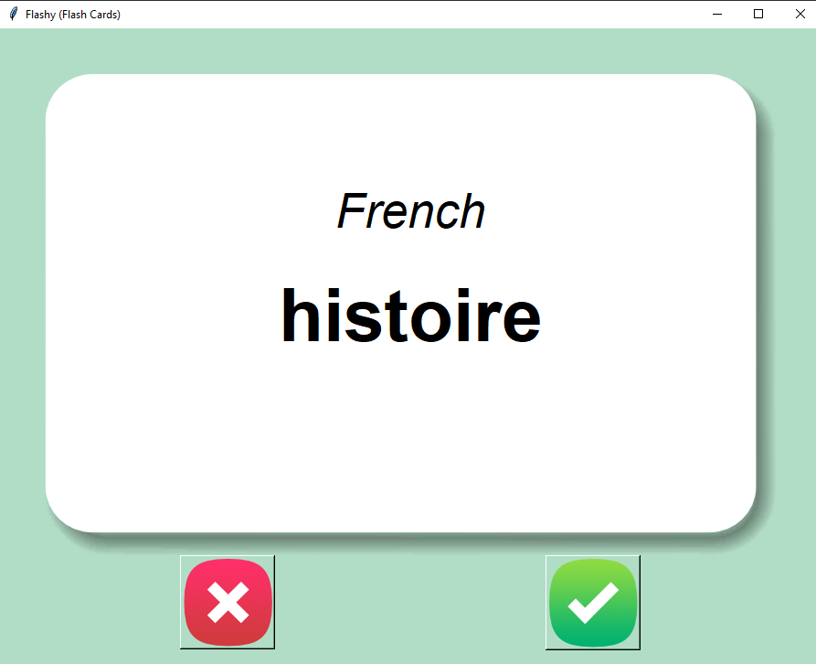
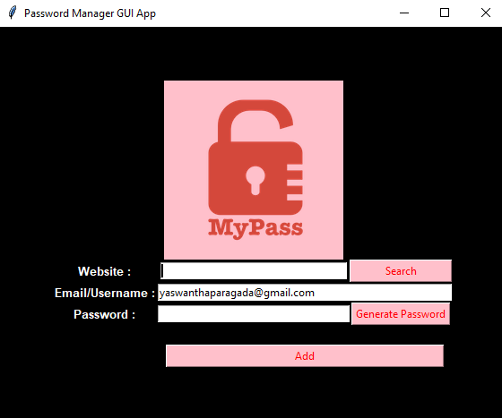
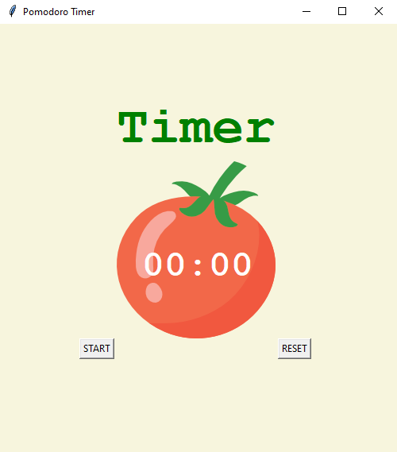
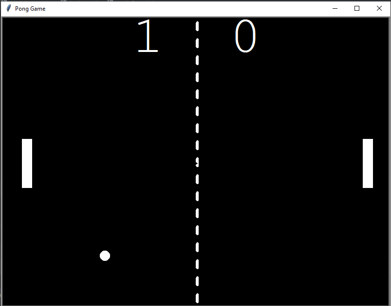

# 🐍 Simple Python Projects Collection

Welcome to my curated collection of beginner-to-intermediate Python projects! Each project is designed to practice and demonstrate core programming concepts including **OOP**, **GUI with Tkinter**, **APIs**, **file handling**, and more.

🔗 GitHub Repo: [yaswantharao05/simple-python-projects](https://github.com/yaswantharao05/simple-python-projects.git)

---

## 📋 Projects Overview

### 1. 🐢 Turtle Crossing Game
- **Concepts Used**: `turtle`, OOP
- A fun arcade-style game where the player controls a turtle trying to cross a road full of moving cars. Each successful crossing increases difficulty.



---

### 2. 🎂 Birthday Wisher
- **Concepts Used**: Python `smtplib`, `datetime`
- Sends automated birthday wishes via email. Reads birthday data and sends customized mail on the correct date.

---

### 3. 🧠 Flashcards
- **Concepts Used**: `tkinter`, CSV file handling
- A GUI-based flashcard app for memorizing French words. Flip the card to reveal the English translation.



---

### 4. 🗺️ India States Quiz
- **Concepts Used**: `tkinter`, `csv`
- An interactive quiz game to test knowledge of Indian states using map-based inputs.

---

### 5. 🌍 ISS Overhead Notifier
- **Concepts Used**: Public API, `smtplib`, geolocation
- Automatically notifies you by email when the International Space Station is passing over your location and it’s dark outside.

---

### 6. 🔐 Password Manager
- **Concepts Used**: `tkinter`, `json`, CSV
- A GUI application to generate, save, and retrieve strong passwords. Data is securely stored in a JSON file.



---

### 7. ⏱️ Pomodoro Study Timer
- **Concepts Used**: `tkinter`
- A productivity timer that follows the Pomodoro technique (25 mins work, 5 mins break) to improve focus and time management.



---

### 8. 🏓 Pong Game
- **Concepts Used**: `turtle`, OOP
- A 2-player arcade-style Pong game built using Python’s turtle module. Features ball movement, collision detection, and score tracking.



---

### 9. ❓ QUIZ (True/False)
- **Concepts Used**: `tkinter`
- A simple true/false quiz app. Random questions are shown, and the player must decide if the statement is true or false.


---

### 10. 🐍 Snake & Food Game
- **Concepts Used**: `turtle`, OOP, file handling
- A classic Snake game built with turtle graphics. Tracks high score using external file storage.


---

## 🧠 Skills Practiced

- Python OOP
- GUI programming (Tkinter)
- Email automation
- APIs & JSON
- CSV & file I/O
- Game development (Turtle)
- Data handling & logic building

---

## 📂 How to Run

1. Clone the repo:
   ```bash
   git clone https://github.com/yaswantharao05/simple-python-projects.git
   cd simple-python-projects
