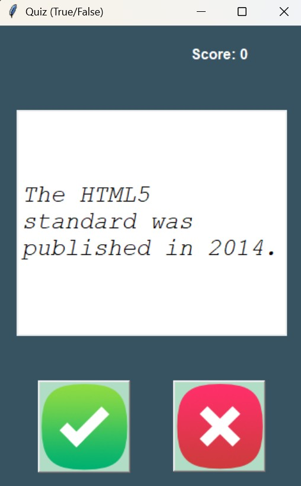
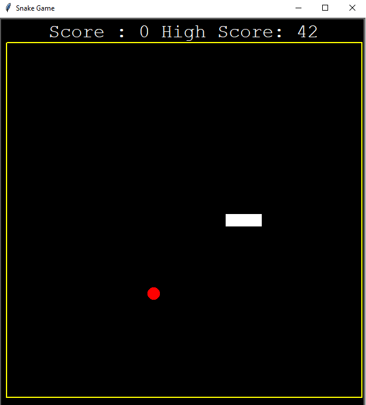
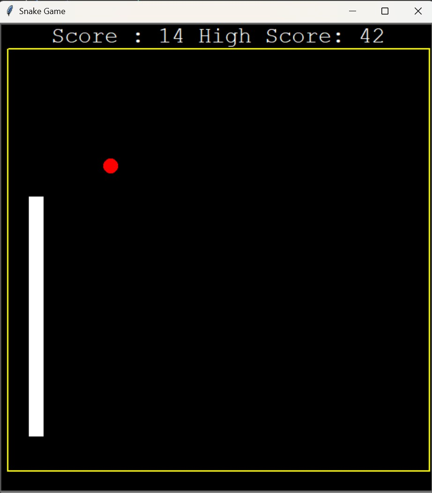

# 🐍 Simple Python Projects Collection

Welcome to my curated collection of beginner-to-intermediate Python projects! Each project is designed to practice and demonstrate core programming concepts including **OOP**, **GUI with Tkinter**, **APIs**, **file handling**, and more.

---

## 📋 Projects Overview

### 1. 🐢 Turtle Crossing Game
- **Concepts Used**: `turtle`, OOP
- A fun arcade-style game where the player controls a turtle trying to cross a road full of moving cars. Each successful crossing increases difficulty.


---

### 2. 🎂 Birthday Wisher
- **Concepts Used**: Python `smtplib`, `datetime`
- Sends automated birthday wishes via email. Reads birthday data and sends customized mail on the correct date.

---

### 3. 🧠 Flashcards
- **Concepts Used**: `tkinter`, CSV file handling
- A GUI-based flashcard app for memorizing French words. Flip the card to reveal the English translation.


---

### 4. 🗺️ India States Quiz
- **Concepts Used**: `tkinter`, `csv`, image mapping
- A visual quiz where the player is shown a **state name**, and they must **click on the corresponding state in a map image**.
- The game compares the user's click location with **predefined coordinates** of Indian states (from a `.csv` file).
- If the clicked point falls within the correct state's boundary → marked **correct**  
- Else → marked **wrong**
- An interactive and engaging way to **learn Indian geography**.

---

### 5. 🌍 ISS Overhead Notifier
- **Concepts Used**: Public API, `smtplib`, geolocation
- Automatically notifies you by email when the International Space Station is passing over your location and it’s dark outside.

---

### 6. 🔐 Password Manager
- **Concepts Used**: `tkinter`, `json`, CSV
- A GUI application to generate, save, and retrieve strong passwords. Data is securely stored in a JSON file.


---

### 7. ⏱️ Pomodoro Study Timer
- **Concepts Used**: `tkinter`
- A productivity timer that follows the Pomodoro technique (25 mins work, 5 mins break) to improve focus and time management.


---

### 8. 🏓 Pong Game
- **Concepts Used**: `turtle`, OOP
- A 2-player arcade-style Pong game built using Python’s turtle module. Features ball movement, collision detection, and score tracking.


---

### 9. ❓ QUIZ (True/False Game)
- **Concepts Used**: `tkinter`, `requests`, API integration
- A GUI-based quiz that fetches **True/False trivia questions** in real-time using the [Open Trivia Database API](https://opentdb.com).
- The quiz dynamically pulls 15 questions from random categories (General Knowledge, Science, History, etc.)
- Sample code:
  ```python
  import random
  import requests

  parameters = {
      'amount': 15,
      'category': random.randint(9, 32),
      'type': 'boolean'
  }
  response = requests.get('https://opentdb.com/api.php', params=parameters)
  question_data = response.json()['results']




---

### 10. 🐍 Snake & Food Game
- **Concepts Used**: `turtle`, OOP, file handling
- A classic Snake game built with turtle graphics. Tracks high score using external file storage.





---

## 🧠 Skills Practiced

- Python OOP
- GUI programming (Tkinter)
- Email automation
- APIs & JSON
- CSV & file I/O
- Game development (Turtle)
- Data handling & logic building

---

## 📂 How to Run

1. Clone the repo:
   ```bash
   git clone https://github.com/yaswantharao05/simple-python-projects.git
   cd simple-python-projects
